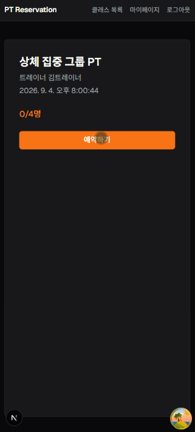

# PT팟 — Frontend

그룹 PT 클래스 예약 시스템의 프론트엔드입니다. 백엔드의 낙관적 락/SSE 기반 실시간 예약 시스템을 실제 사용자가 쓸 수 있는 화면으로 구현했습니다.

- 🔗 **Live Demo**: https://pt-reservation-frontend.vercel.app
- ⚙️ **백엔드 저장소**: [pt-reservation-backend](https://github.com/PT-reservation/pt-reservation-backend)

> 백엔드가 무료 플랜(Render)이라 15분 이상 요청이 없으면 슬립됩니다. 접속 후 데이터가 안 뜨면 20~50초 정도 기다렸다가 새로고침해주세요.

---

## 실시간 반영 (SSE)

브라우저의 `EventSource` API는 커스텀 헤더(`Authorization`)를 지원하지 않아서, 인증이 필요한 개인 알림 스트림은 JWT를 쿼리 파라미터로 전달하는 방식으로 연결했습니다 (`/notifications/events?token=...`).

- **클래스 상세 화면**: 다른 사용자의 예약/취소로 좌석 수가 바뀌면 새로고침 없이 실시간 반영 ([`useClassEvents`](src/hooks/useClassEvents.ts))
- **개인 알림**: 대기 중이던 예약이 자동 확정되거나, 세션권 부족으로 승격이 스킵되면 실시간 토스트 알림 ([`useNotificationEvents`](src/hooks/useNotificationEvents.ts))
- 두 경우 모두 이벤트 수신 시 TanStack Query의 `invalidateQueries`로 관련 캐시를 무효화해, 실제 화면 갱신은 기존 `useQuery` 로직을 그대로 재사용합니다

## 화면 구성

| 화면              | 경로                | 설명                                   |
| ----------------- | ------------------- | -------------------------------------- |
| 홈 (클래스 목록)  | `/`                 | 전체 클래스 목록, 좌석 현황            |
| 클래스 상세       | `/classes/[id]`     | 상세 정보, 예약/취소, 실시간 좌석 반영 |
| 회원가입 / 로그인 | `/signup`, `/login` | 역할(회원/트레이너) 선택 가입          |
| 마이페이지        | `/mypage`           | 내 예약 이력, 세션권 조회/충전         |
| 내 클래스 관리    | `/trainer/classes`  | (트레이너 전용) 클래스 등록/수정/삭제  |

## 데모

### 실시간 반영 (SSE)



## 기술 스택

| 분류           | 사용 기술                                                 |
| -------------- | --------------------------------------------------------- |
| Framework      | Next.js 16 (App Router)                                   |
| Language       | TypeScript                                                |
| UI             | React 19, Tailwind CSS v4                                 |
| 서버 상태 관리 | TanStack Query                                            |
| 인증           | JWT (localStorage 저장, `React Context`로 전역 상태 공유) |
| 실시간         | Server-Sent Events (`EventSource`)                        |
| 배포           | Vercel                                                    |

## 로컬 실행

```bash
npm install

# .env.local 생성 후 아래 값 추가
# NEXT_PUBLIC_API_URL=http://localhost:8080   (백엔드를 로컬에서 실행 중일 때)
# 또는 배포된 백엔드를 바라보고 싶다면:
# NEXT_PUBLIC_API_URL=https://pt-reservation-backend.onrender.com

npm run dev
```
